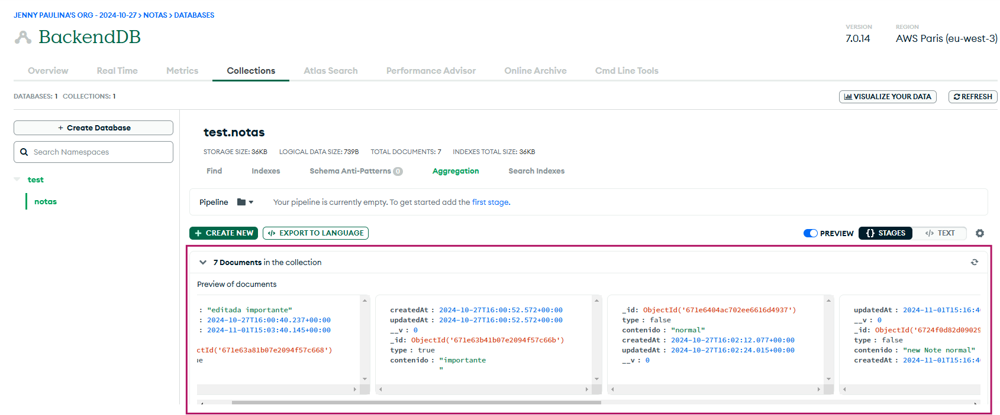
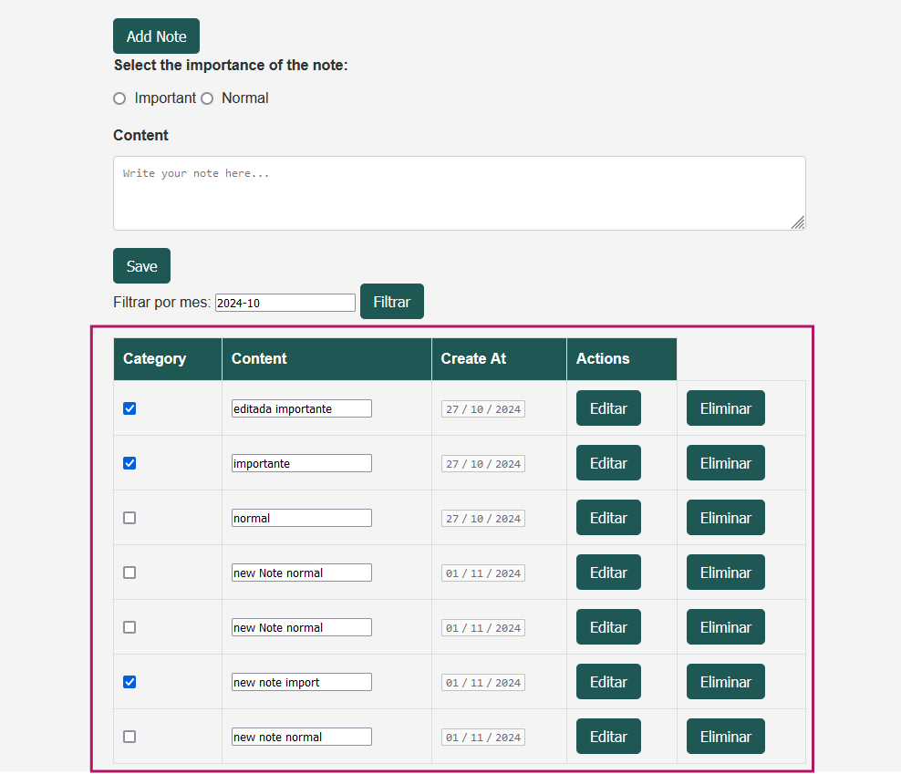

# Proyecto de Notas

Este proyecto es una aplicación de gestión de notas, donde se pueden agregar, clasificar y filtrar notas por importancia y fecha. La aplicación cuenta con una API en Node.js y una interfaz web para visualizar y gestionar las notas.

## Estructura del Proyecto

```plaintext
.
├── notas-proyecto
|   ├── imagenes
│   ├── models
│   │   └── nota.model.js   	# Conexión con la base de datos y definición del modelo de Nota
│   ├── node_modules        	# Dependencias de Node.js
│   ├── web
│   │   ├── css
│   │   │   └── style.css   	# Estilos para la aplicación web
│   │   ├── src
│   │   │   └── script.js   	# Lógica del cliente web
│   │   └── index.html      	# Interfaz web del cliente
│   ├── index.js            	# Conexión con el servidor y rutas de la API
│   ├── package.json        	# Configuración de npm
│   └── package-lock.json   	# Registro de versiones de dependencias
```

## Requisitos Previos

- Node.js instalado
- npm (que se incluye con Node.js)
- Cuenta en [MongoDB Cloud](https://cloud.mongodb.com/) para alojar la base de datos

## Instalación

1. **Clona el repositorio** en tu máquina local:
   ```bash
   git clone (https://github.com/Jenny-Vasquez/Practica1.-DOM-REST-API)
   cd notas-proyecto
   ```

2. **Instala las dependencias**:
   ```bash
   npm install
   ```

3. **Configura la base de datos en MongoDB Cloud**:
   - Accede a tu cuenta de MongoDB Cloud y crea una base de datos.
   - Actualiza la IP permitida para conexiones en MongoDB Cloud.
   - Actualiza la URL de conexión en `nota.model.js` para enlazar con tu base de datos.

4. **Inicia el servidor**:
   ```bash
   npm run dev
   ```
   El servidor se ejecutará en el puerto `5000`.

## Uso de la API

### Endpoints Disponibles

| Método | Endpoint   	| Descripción                  	|
|--------|----------------|----------------------------------|
| GET	| `/api/notes`   | Obtener todas las notas     	|
| POST   | `/api/notes`   | Crear una nueva nota        	|
| PUT	| `/api/notes/:id` | Actualizar una nota específica |
| DELETE | `/api/notes/:id` | Eliminar una nota específica   |

### Verificación con Postman

Para verificar que los métodos **POST**, **GET**, **DELETE** **PUT** funcionan correctamente, hemos utilizado Postman. Asegúrate de que el servidor está en ejecución antes de probar los endpoints.

## Funcionalidades

- **Agregar Notas**: Se pueden agregar notas con un contenido específico y marcar si son importantes.
- **Clasificación por Importancia**: Las notas pueden marcarse como "importantes" o "normales".
- **Listado de Notas**: Se muestra un listado de todas las notas disponibles, donde las que están marcadas como "importantes" se indican con un check.
- **Filtrado por Mes**: Las notas pueden filtrarse para mostrar solo aquellas creadas en un mes específico.

## Interfaz Web

La interfaz web es accesible desde `index.html`. Incluye las siguientes secciones:

- **Lista de Notas**: Muestra todas las notas registradas.
- **Formulario de Adición de Notas**: Permite agregar nuevas notas.
- **Filtrado de Notas**: Permite filtrar notas por mes.

## Imágenes del Proyecto

### Ejemplo de Uso en Postman


### Base de Datos




### Vista de la API


### Listado de Notas

En esta sección, podemos ver las notas añadidas, donde las importantes están señaladas.



### Filtrado por Mes

Esta sección muestra el filtrado de notas según el mes de creación.


## Autor

Desarrollado por Jenny P. Vásquez.

